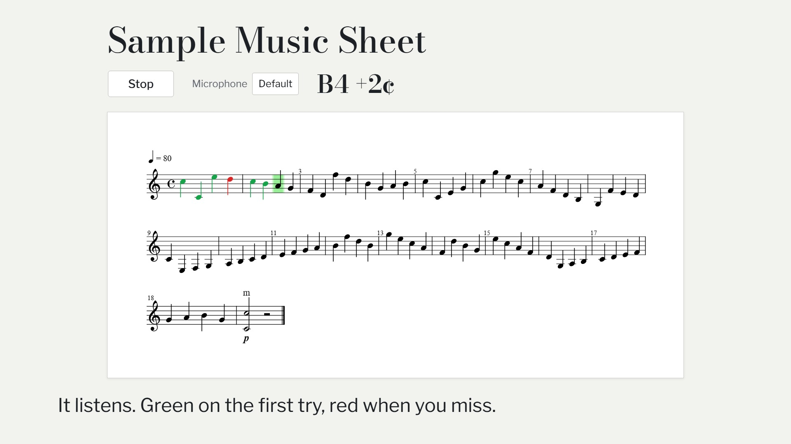

# Etude Man

Turn the page your guitar teacher assigned into a practice session that listens to you play, marks every note right or wrong, and shows you the note-to-note transitions you keep missing.

**Live app:** https://etude-man.vercel.app

[](demo/etude-man-demo.mp4)

*Click the image to watch the demo video.*

## Why

Apps like Yousician give live feedback, but only on their own curriculum. Etude Man gives that feedback on *your* homework: the exercise from your method book.

Most mistakes aren't about single notes. They happen on the *move between two notes*: a string crossing, a jump from a low string to a high one, a stretch. So Etude Man tracks misses and hesitation for each transition (note A → note B) and ranks the weak ones.

## What it does

1. **Upload.** Take a phone photo of an exercise page. Flat.io's optical music recognition turns it into MusicXML. If photo recognition isn't available, you can upload a MusicXML file directly, for example one exported from Flat.
2. **Practice.** The score renders in the browser and a cursor waits on each note. Play into the microphone and each note turns green (correct) or red (missed). The cursor only moves on once you play the expected note. A live readout shows the detected note and how many cents off it is.
3. **Report.** After practicing, see your overall accuracy and your weakest transitions, ranked by miss rate and then by median hesitation.

Single-note melodies only. Chords and tablature are not supported.

## Try it without a guitar 🎧

No instrument? No problem. [`demo/sample_music_sheet.mp3`](demo/sample_music_sheet.mp3) is a recording of me playing the pre-loaded exercise, **Sample Music Sheet**, on guitar.

1. Log in and open **Sample Music Sheet** from the exercise list.
2. Click **Start** and allow microphone access.
3. Play the MP3 near your microphone: from your phone, or from the same computer's speakers. The app turns off echo cancellation and noise suppression, so it hears your own speakers fine.
4. Watch the cursor follow the recording and the notes turn green.
5. Open the **Report** page to see the transitions from your attempt.

Tips:

- Moderate volume works best. Very quiet playback may not register as new plucks; very loud playback can distort.
- The cursor waits for the correct note, so if the app misses one, it will wait there while the recording moves on. Restart the attempt and play the recording again, a little louder or closer to the mic.
- If low notes read unstably, the app suggests trying another microphone. You can switch inputs from the **Microphone** dropdown on the practice page.
- You can also hum or whistle notes, or play them from any piano or tuner app.

## Demo accounts

Sign-ups are disabled. The app has seeded accounts:

| Email | Notes |
|---|---|
| `reviewer1@example.com` | Starts clean |
| `reviewer2@example.com` | Starts clean |
| `demo@example.com` | Has **sample** practice history, so the report page is meaningful right away |

Ask me for the password.

## Tech stack

- **Client:** React 19, Vite, React Router, Tailwind CSS with shadcn/ui
- **Score rendering:** [OpenSheetMusicDisplay](https://opensheetmusicdisplay.org/)
- **Pitch detection:** [pitchy](https://github.com/ianprime0509/pitchy) on Web Audio microphone frames
- **API:** Express, deployed as a Vercel function under `/api`
- **Auth:** Better Auth (email and password)
- **Database:** Postgres with Prisma
- **Sheet music recognition:** Flat.io OMR API
- **Tests:** Vitest and React Testing Library for logic and components, Playwright end to end (with a fake microphone)

### How detection works

- Guitar is notated an octave above where it sounds. All stored pitches are *written* pitch; the only conversion is `sounding = written − 12` when comparing against the microphone.
- A note is correct when its nearest semitone matches the target (within ±50 cents).
- Every event needs a new pluck (a jump in volume). Within one pluck only the first stable pitch counts, and the previous note's ringing is ignored right after the cursor moves, so one note is never counted twice.
- **Miss rate** for a transition is the share of its occurrences with at least one miss. **Hesitation** is the time from playing the first note correctly to playing the second one correctly.

More detail lives in [`SCOPE.md`](docs/SCOPE.md), [`TECH_SPEC.md`](docs/TECH_SPEC.md) and [`IMPLEMENTATION_PLAN.md`](docs/IMPLEMENTATION_PLAN.md).

## Run it locally

Requirements: [Bun](https://bun.sh/) and a Postgres database.

```bash
bun install
cp .env.example .env    # fill in the values (see below)
bunx prisma migrate dev # create the tables
bun run db:seed         # create the demo accounts and the sample exercise
bun run dev             # API on :3001, app on http://localhost:5173
```

Environment variables (see [`.env.example`](.env.example)):

| Variable | Purpose |
|---|---|
| `DATABASE_URL`, `DIRECT_DATABASE_URL` | Postgres connection (the same URL locally) |
| `BETTER_AUTH_SECRET`, `BETTER_AUTH_URL` | Auth session secret and the app URL (`http://localhost:5173` locally) |
| `FLAT_TOKEN` | Flat.io personal access token, for photo uploads |
| `SEED_PASSWORD` | Password for the seeded accounts |
| `TEST_DATABASE_URL` | Separate database for end-to-end tests |

All secrets stay on the server; the browser only talks to the app's own API.

### Other commands

```bash
bun run test       # unit and component tests
bun run test:e2e   # Playwright end-to-end tests (own servers and test database)
bun run typecheck  # type-check only
bun run build      # type-check and build the client into dist/
```

## Roadmap

- AI-generated drills that target your weakest transitions, played in the same practice mode
- Tempo mode: the cursor moves at a set BPM and timing is scored
- Tuning check before practice
- Fretboard diagram for the current note
- Looping a selected section
- Progress over time per transition
- Using a phone as the microphone
- Editing OMR mistakes note by note
